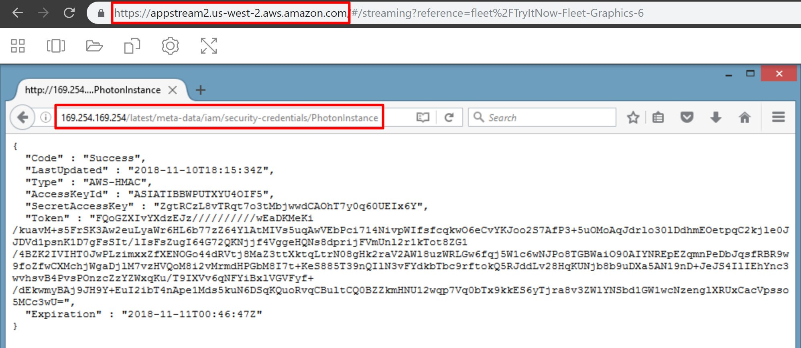
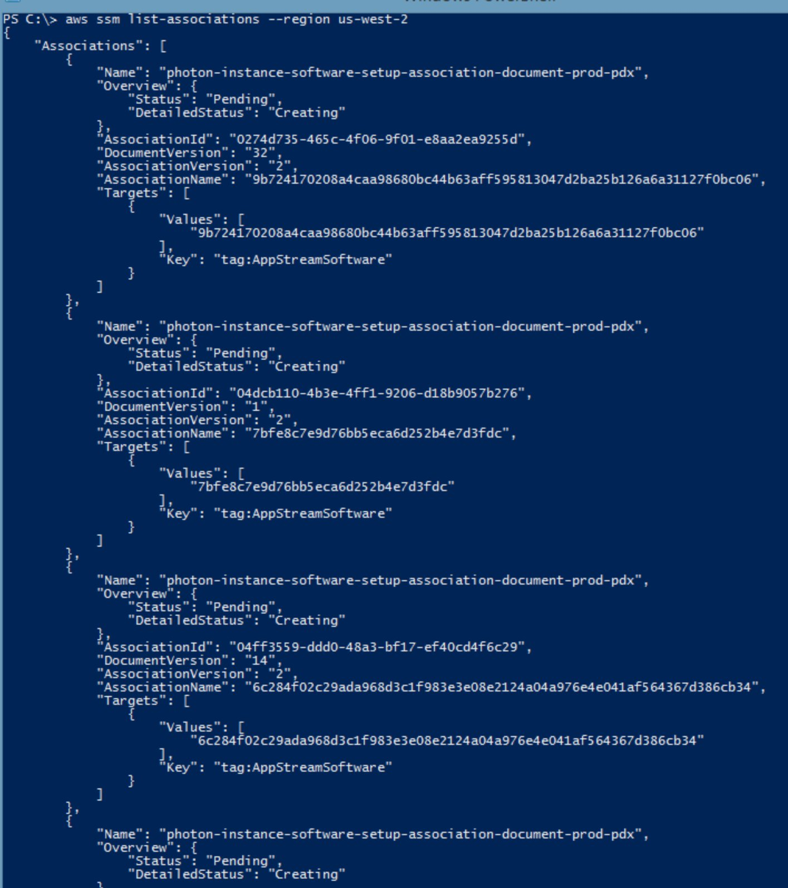
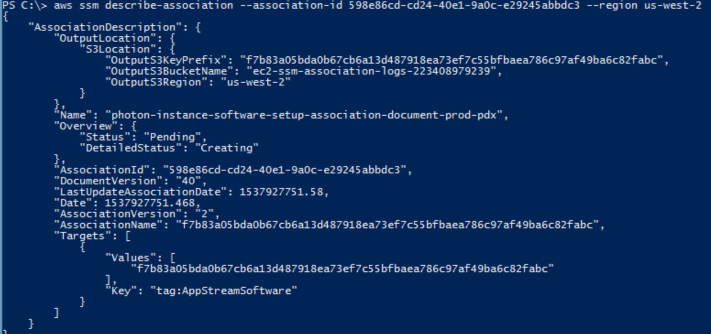
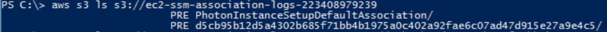
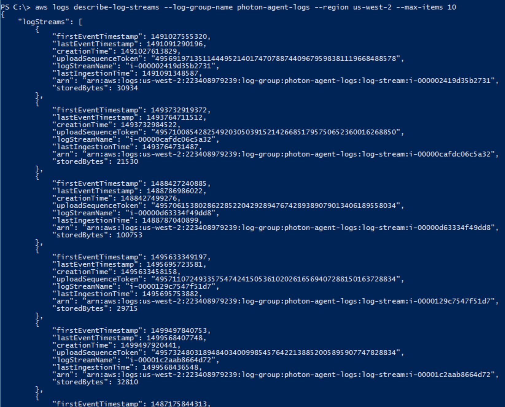

# Getting AWS-Owned Access Keys from AppStream 2.0
It's possible to pull AWS credentials that belong to an AWS-owned AWS account from within AppStream 2.0. Even if you run the same application in your own account, the keys will still belong to AWS because of how the service works. This was reported to AWS Security multiple times and every time it was confirmed to be working as intended.

**Original Source:** https://twitter.com/SpenGietz/status/1062045349005549568

## Steps to Reproduce
1. Go to the `Try It Now` page for AppStream 2.0: https://us-west-2.console.aws.amazon.com/appstream2/tryitnow/home?region=us-west-2#/
2. Choose `Firefox` as your application.
3. Go to the following URL in Firefox to get your AWS-owned AWS credentials: http://169.254.169.254/latest/meta-data/iam/security-credentials/PhotonInstance  

As of the original release date (November 2018), the PhotonInstance role seemed to have the `AmazonEC2RoleforSSM` IAM policy attached to it, which grants all kinds of access!  

At the time (not sure if it has been updated since then), you could pull information about other AppStream instances, read/write their S3 buckets, write logs to their CloudWatch log streams, and more. Here are some example screenshots from the original Tweet:  

  

  

  

  

**Note:** If the permissions on that role have not been updated yet, there are a lot more things you can do with the `AmazonEC2RoleforSSM` IAM policy! Consider checking out the EC2 User Data of that instance as well.  
