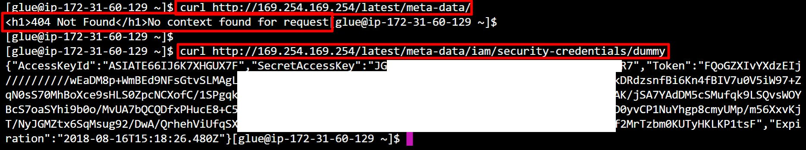

# Getting AWS Credentials From Glue Development Endpoints
Most of the EC2 metadata API is disabled in AWS Glue Development Endpoints, but it is still possible to pull the credentials of the IAM role that is attached to it through the regular path. Most endpoints will 404, but there is a hardcoded endpoint to retrieve the credentials of the role. This can be used for privilege escalation in some scenarios as well.

**Source:** https://twitter.com/SpenGietz/status/1030099156012953600

From within a Glue Development Endpoint, run the following command: `curl http://169.254.169.254/latest/meta-data/iam/security-credentials/dummy`  

You will get returned the keys belonging to whatever role is attached to that Development Endpoint! The following screenshot shows that the typical `/latest/meta-data/` endpoint returns a 404, but the IAM credentials endpoint still works when using the hardcoded name `dummy` (regardless of what the actual role is named).  

  
