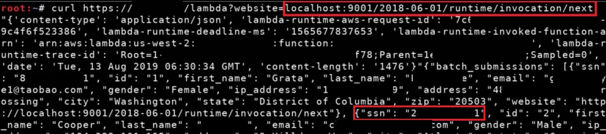

# Got an SSRF in AWS Lambda? Hit the runtime API
AWS Lambda functions expose an internal API on localhost port 9001 that is meant for custom Lambda runtimes, but it is accessible from within an active invocation of a function. This means that if you get remote code execution or a server side request forgery vulnerability within a Lambda function, you can query that API. The `/2018-06-01/runtime/invocation/next` endpoint will return the event data that was passed into the function for that current execution, where you may be able to find secrets or other useful information to extend your attack into the environment.  

Documentation for the Lambda runtime API can be found here: https://docs.aws.amazon.com/lambda/latest/dg/runtimes-api.html#runtimes-api-next  

## Example
**Source:** https://twitter.com/SpenGietz/status/1161317376060563456
```
Got RCE or SSRF inside an AWS Lambda function? Request "localhost:9001/2018-06-01/runtime/invocation/next" for the function's event data. Check the HTTP headers returned too! 
```

  

## Other Useful Tips  
- Look at the HTTP headers returned from the Lambda runtime API if you are able to for a little bit more information.  
- Don't forget to pull the AWS keys from the function's environment variables if you are able to (`AWS_ACCESS_KEY_ID`, `AWS_SECRET_ACCESS_KEY`, and `AWS_SESSION_TOKEN`)!  
- Got local file read? Read `/proc/self/environ` for the environment variables of the function (including the AWS keys).  
