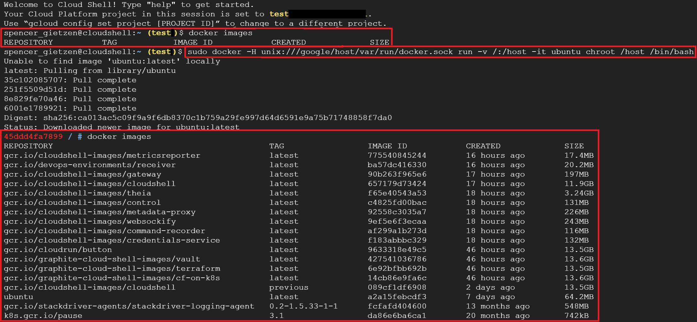
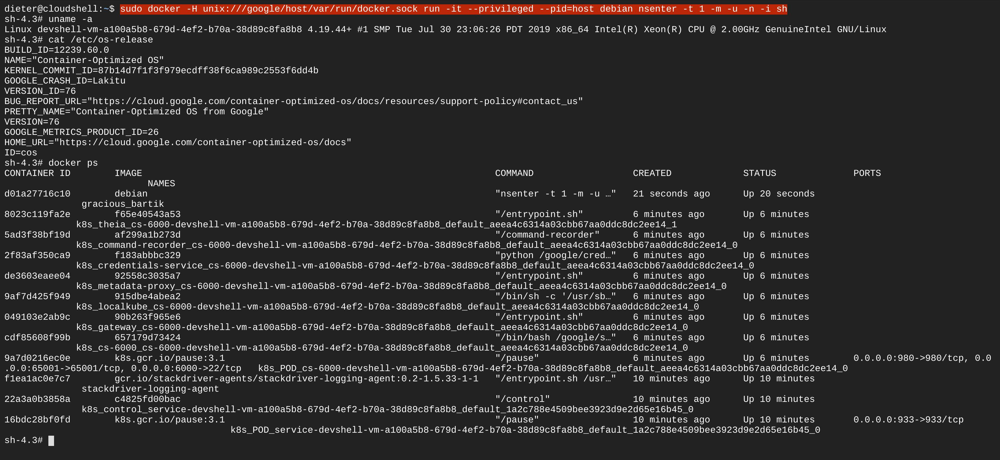

# GCP Cloud Shell Docker Escape
This allows anyone to access the host VM that is running the Cloud Shell Docker container as the root user. Just run one of the following commands from within your GCP Cloud Shell to escape it. This was originally reported to Google Security and it was determined to not be a security risk. The host is isolated from other GCP users and as of recently they even let you use your own Docker container (based off of Cloud Shell) for your own Cloud Shell, so the escape is working as intended.

## V1 (The original version)
**Source:** https://twitter.com/SpenGietz/status/1166752505889316864  

**Command:** `sudo docker -H unix:///google/host/var/run/docker.sock run -v /:/host -it ubuntu chroot /host /bin/bash`  

  

**Note:** It was pointed out by another user on Twitter ([@Quintus23M](https://twitter.com/Quintus23M)) that the command above is not actually a full Docker escape. It essentially mounts the host file system within the container, giving you access to the host, but not giving you full root access to it. That user kindly responded with an alternative command to fully escape the container and be the root user on the host VM (v2 below).  

## V2 (The better version)
**Source:** https://twitter.com/Quintus23M/status/1166828814091112449  

**Command:** `sudo docker -H unix:///google/host/var/run/docker.sock run -it --privileged --pid=host debian nsenter -t 1 -m -u -n -i sh`  

  

**Note:** I personally replace `debian` with `ubuntu` and `sh` with `/bin/bash`, but it's all preference.  
